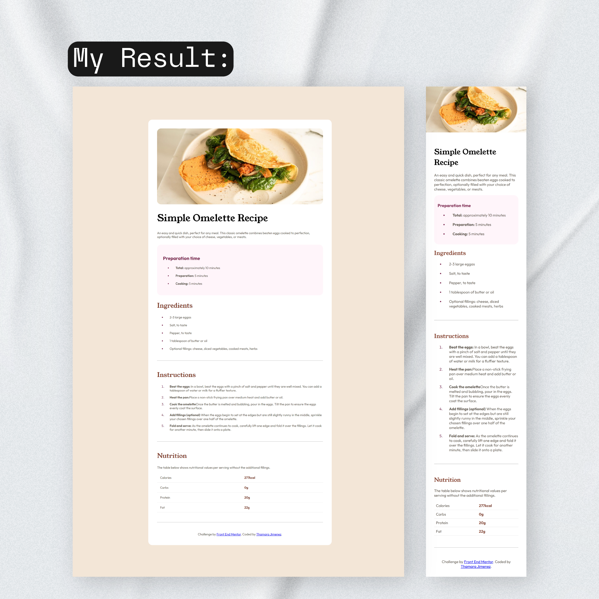

# Frontend Mentor - Recipe page solution

This is a solution to the [Recipe page challenge on Frontend Mentor](https://www.frontendmentor.io/challenges/recipe-page-KiTsR8QQKm). Frontend Mentor challenges help you improve your coding skills by building realistic projects. 

## Table of contents

- [Overview](#overview)
  - [The challenge](#the-challenge)
  - [Screenshot](#screenshot)
  - [Links](#links)
- [My process](#my-process)
  - [Built with](#built-with)
  - [What I learned](#what-i-learned)
- [Author](#author)

**Note: Delete this note and update the table of contents based on what sections you keep.**

## Overview

### Screenshot

### Links

- Solution URL: [MY CODE](https://github.com/ThamaraQueen/recipe-page-main)
- Live Site URL: [RESULT](https://thamaraqueen.github.io/recipe-page-main/)

## My process
I began by outlining the structure of the HTML to ensure that all key elements were correctly placed and semantically meaningful. This included creating the basic skeleton with headings, paragraphs, lists, and images to represent the recipe content.

Once the HTML structure was in place, I moved on to the CSS. I started by defining the overall layout, focusing on the container to center the content and apply background colors. I then worked on styling individual elements like the headings, text, and lists, ensuring consistent font choices and colors. To enhance the visual hierarchy, I applied different font sizes and weights to make the content easy to read and engaging.

For the images, I used `object-fit` to maintain their proportions while ensuring they fit nicely within the container. I also added some margin and padding adjustments to maintain proper spacing between sections.

Finally, I made the design responsive by incorporating media queries, allowing the layout to adjust for smaller screen sizes, particularly mobile screens with a width of 375px. This ensured that the content remains readable and visually appealing across different devices.

### What I learned

I really enjoyed working on this challenge. It was straightforward and a great way to get started, but I know it’s just the beginning. My goal is to complete a new challenge every week, gradually increasing the difficulty to push myself further. I’m excited to continue improving and taking on more complex projects as I progress!

## Author

- LinkedIn - [Thamara Jimenez](www.linkedin.com/in/thamara-jimenez-a60ba9244)
- Frontend Mentor - [@ThamaraQueen](https://www.frontendmentor.io/profile/ThamaraQueen)
